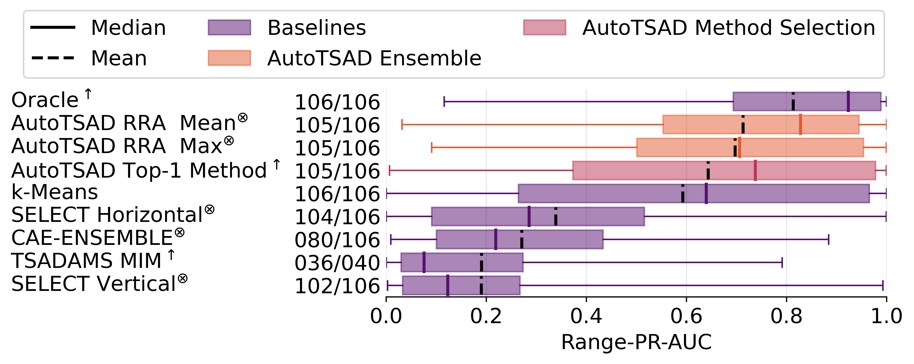
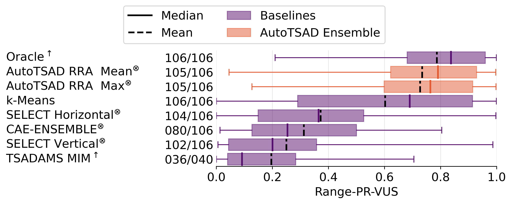
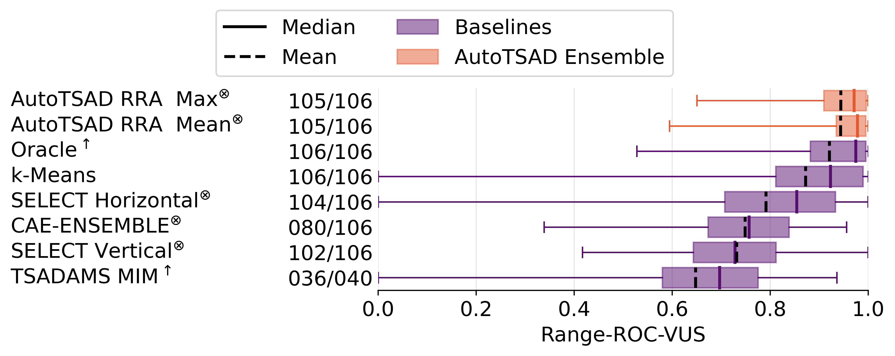
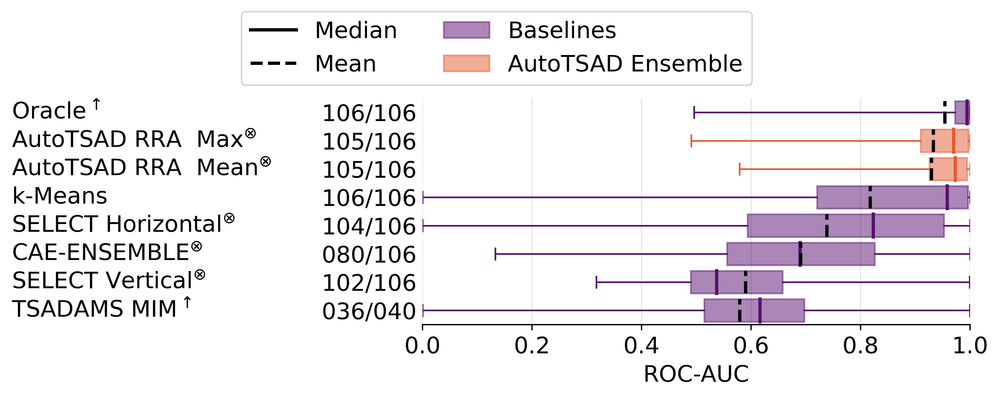

<div align="center">

<h1 align="center">AutoTSAD</h1>
<p>
Unsupervised Anomaly Detection System for Univariate Time Series.
</p>

[](https://opensource.org/licenses/MIT)


</div>

---

Detecting anomalous subsequences in time series data is one of the most important tasks in time series analytics, having applications in environmental monitoring, preventive healthcare, predictive maintenance, and many further areas.
Data scientists have developed various anomaly detection algorithms with individual strengths, such as the ability to detect repeating anomalies, anomalies in non-periodic time series, or anomalies with varying lengths.
For a given dataset and task, the optimal algorithm with a suitable parametrization and, in some cases, sufficient training data, usually solves the anomaly detection problem well.
However, given the high number of existing algorithms, their numerous parameters, and a pervasive lack of training data and domain knowledge, effective anomaly detection is still a complex task that heavily relies on manual experimentation and, often, luck.

AutoTSAD is an unsupervised system, which **parameterizes, executes, and ensembles various highly effective anomaly detection algorithms**.
The system automatically presents highly flexible anomaly scorings for arbitrary time series.
Any such scoring can be broken down into our novel score ranking that also non-expert users can interactively explore and extend.
Our experiments show that AutoTSAD offers an anomaly detection accuracy comparable to the best manually optimized anomaly detection algorithms, but without a need for training data or parameter expertise.

### Architecture

AutoTSAD consists of the three modules _Data Generation_, _Algorithm Optimization_, and _Scoring Ensembling_.
It takes a single univariate time series as input and produces a score ranking and an aggregated anomaly scoring.
The score ranking can interactively be explored and altered.


### Base Algorithms

| Algorithm  | Area          | Family       | Dim.  | Lang.  |
| :--------- | :------------ | :----------- | :---: | :----- |
| STOMP      | Data Mining   | distance     |  uni  | Python |
| k-Means    | Classic ML    | distance     | multi | Python |
| Sub-KNN    | Classic ML    | distance     |  uni  | Python |
| Sub-LOF    | Outlier Det.  | distance     |  uni  | Python |
| Sub-IF     | Outlier Det.  | trees        |  uni  | Python |
| GrammarViz | Data Mining   | encoding     |  uni  | Java   |
| Torsk      | Deep L.       | forecasting  | multi | Python |
| DWT-MLEAD  | Signal A.     | distribution |  uni  | Python |

## Repository Structure

| **Folder** | **Description** |
| :--------- | :-------------- |
| [`autotsad`](./autotsad/) | AutoTSAD source code. |
| [`autotsad.tsad_algorithms`](./autotsad/tsad_algorithms/) | Base algorithm implementations for the ensemble. |
| [`autotsad.baselines`](./autotsad/baselines) | Implementation for the SELECT and tsadams baselines. |
| [`data/autotsad-data`](./data/autotsad-data) | Evaluation datasets. |
| [`data/baseline-results`](./data/baseline-results/) | Folder for the baseline results (just for the Oracle baseline for now). |
| ... | tbd |
| [`requirements.txt`](./requirements.txt) | Pip-dependencies required to run AutoTSAD. |
| [`autotsad.yaml`](./autotsad.yaml) | Configuration file template. Please find the configuration key documentation [here](./autotsad/config.py). |
| [`autotsad-exp-config.yaml`](./autotsad-exp-config.yaml) | AutoTSAD onfiguration used for the experiments. |

## Results

We compare the anomaly detection quality of AutoTSAD with three to four baselines on all 106 univariate time series in the [`data`](./data)-folder.
The baseline algorithms are the following:

- **Oracle**: Perfect selection algorithm that _magically_ selects the best performing algorithm for every time series from the 71 [TimeEval-algorithms](https://github.com/HPI-Information-Systems/timeeval-algorithms) based on the Range-PR-AUC metric.
- **Random Algorithm**: Mean quality of the 71 TimeEval-algorithms for each time series.
  We computed the results only for the Range-PR-AUC and Range-ROC-AUC metrics.
- **k-Means**: Individual time series anomaly detection algorithm, which achieved overall best results.
- **SAND**: Individual time series anomaly detection algorithm, which is particularly specialized for time series with different base behaviors and shifting anomalies.

For all baseline algorithms and AutoTSAD, we use the [manually-tuned hyperparameter heuristics from TimeEval](https://github.com/HPI-Information-Systems/TimeEval/blob/main/timeeval_experiments/param-config.json).

### Range-PR-AUC Metric



### Other metrics

<div style="width: 100%; overflow: hidden;">
  <div style="width: 49%; float: left;">

  
  

  </div>
  <div style="margin-left: 51%;">

  
  

  </div>
</div>


## Installation

### Requirements

- python >= 3.8
- Java >= 1.8 (for GrammarViz)

### Installation from Source

We recommend to use `conda` or any other virtual environment management tool to create a new Python environment for AutoTSAD.
Please make sure that `python`, `pip`, and `java` are accessible in your new environment.

1. Clone repository

   ```bash
   git clone git@github.com:HPI-Information-Systems/AutoTSAD.git
   cd AutoTSAD
   ```

2. (Create your environment and) install Python dependencies

   ```bash
   pip install -r requirements.txt
   ```

3. Install AutoTSAD

   ```bash
   python setup.py install
   ```

## Usage

**tl;dr**

```sh
$ autotsad --help
usage: autotsad [-h] [--version] {completion,run,db,estimate-period} ...

Unsupervised anomaly detection system for univariate time series.

positional arguments:
  {completion,run,db,estimate-period}
    completion          Output shell completion script
    run                 Run AutoTSAD on a given dataset.
    db                  Manage AutoTSAD result database.
    estimate-period     Estimate the period size of a given time series dataset.

optional arguments:
  -h, --help            show this help message and exit
  --version             Show version number of AutoTSAD.
```

Example call:

```bash
$ autotsad run --config-path autotsad.yaml data/timeeval/GutenTAG/ecg-diff-count-1.csv

AutoTSAD v0.2.2
------------------------                                                                                                 
CACHING directory=tmp/cache/6da004d6bd0cb6151622649862fcc418
RESULT directory=tmp/2023-10-17_15-50-20-6da004d6bd0cb6151622649862fcc418                     
Configuration=
AutoTSADConfig(
    general=GeneralSection(                                                                           
        tmp_path=PosixPath('tmp'),                                                                               
        result_path=PosixPath('tmp'),
        TIMESTAMP='2023-10-17_15-50-20',
        cache_key='6da004d6bd0cb6151622649862fcc418',
        logging_level=0,
        use_timer=True,
        timer_logging_level=20,
        progress=True,
        n_jobs=2,
        seed=2,
        max_algorithm_instances=6,
        algorithm_selection_method='aggregated-minimum-influence',
        score_normalization_method='minmax',
        score_aggregation_method='custom',
[...]
```

### Configuration

All configuration options of AutoTSAD are managed in a configuration file that you specify before starting the system.
AutoTSAD works fine with default options;
please only change them if you know what you are doing.

You can specify all configuration settings (see configuration file) also via environment variables with the prefix `AUTOTSAD`.
Examples:

- Change the folder for temporary files and the cache `config.general.tmp_path`:  
  `AUTOTSAD__GENERAL__TMP_PATH=/tmp/custom-folder`
- Increase parallelism `config.general.n_jobs`:  
  `AUTOTSAD__GENERAL__N_JOBS=10`
- Disable hyperparameter optimization steps `config.optimization.disabled`:  
  `AUTOTSAD__OPTIMIZATION__DISABLED=true`

### Shell Completion

AutoTSAD comes with shell auto-completion scripts for bash and zsh.
To enable them, run the following commands:

- Bash:

  ```bash
  autotsad completion bash > /etc/bash_completion.d/autotsad
  ```

- Zsh:

  ```zsh
  autotsad completion zsh > /usr/local/share/zsh/site-functions/_autotsad
  ```

- Zsh (with Oh-My-Zsh):

  ```zsh
  mkdir ~/.oh-my-zsh/completions
  autotsad completion zsh > ~/.oh-my-zsh/completions/_autotsad
  ```

> :warning: Note that the auto-completions can noticably slow down your shell.

## Reference

tbd
